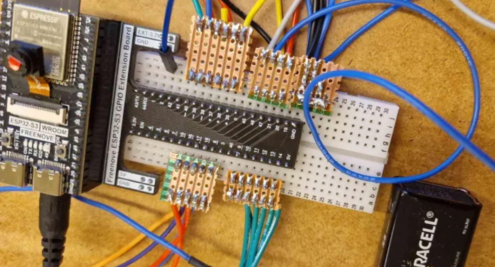
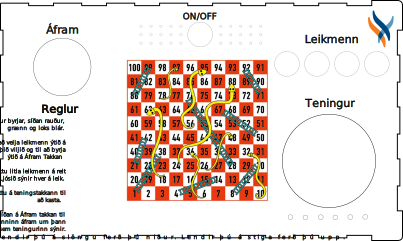

# Samstigur_lokaverkefni
Samúel og Stígur. Lokaverkefni í VESM1VS05AU

Þú byrjar á því að ýta á ON takkann eftir að kveikja, þá velur þú litina sem þú vilt nota. Leikröðinn er gulur, rauður, grænn og blár. Eftir að þú hefur valið leikmenn ýtir þú á Áfram takkann. Þá logar takki leikmanns sem á að gera og þá á maður að ýta á teningatakkann gula og þá sýna leds undir takkanum hvaða tölu þú fékkst. Til að bæta þeim númerum við stöðuna þína þarft þú að ýta á Áfram takkann. Þegar einhver leikmaður er komin með meira en 100 vinnur sá leikmaður og spilið er búið, til að spila aftur getur þú ýtt á ON takkann.

# Lóðun

# Borðspil

# Ljósmyndir af borðspili (inní kassa og utan)

# Video

# Kóði
import random
import time
from machine import Pin, PWM

on_takki = Pin(36, Pin.IN, Pin.PULL_UP)
aframtakki = Pin(47, Pin.IN, Pin.PULL_UP)
teningatakki = Pin(21, Pin.IN, Pin.PULL_UP)

takki_yellow = Pin(2, Pin.IN, Pin.PULL_UP)
takki_red = Pin(38, Pin.IN, Pin.PULL_UP)
takki_green = Pin(40, Pin.IN, Pin.PULL_UP)
takki_blue = Pin(39, Pin.IN, Pin.PULL_UP)

led_yellow = Pin(16, Pin.OUT)
led_red = Pin(17, Pin.OUT)
led_green = Pin(8, Pin.OUT)
led_blue = Pin(18, Pin.OUT)

spilendur_leds = [led_yellow, led_red, led_green, led_blue]
spilendur_buttons = [takki_yellow, takki_red, takki_green, takki_blue]
spilendur_names = ["Gulur", "Rauður", "Grænn", "Blár"]

teninga_leds = [
    Pin(9, Pin.OUT),
    Pin(10, Pin.OUT),
    Pin(11, Pin.OUT),
    Pin(12, Pin.OUT),
    Pin(13, Pin.OUT),
    Pin(14, Pin.OUT)
]

led_teninga = Pin(20, Pin.OUT)
led_afram = Pin(48, Pin.OUT)
led_on = Pin(15, Pin.OUT)

speaker = PWM(Pin(35))
speaker.duty(0)

snakes_ladders = {
    4:14, 9:31, 21:42, 28:84, 36:44, 51:67, 71:91, 80:100,
    16:6, 47:26, 49:11, 56:53, 62:19, 64:60, 87:24, 93:73, 95:75, 98:78
}

while True:
    led_on.value(1)
    
    while on_takki.value() == 1:
        pass
    
    led_on.value(0)

    for L in spilendur_leds: L.value(0)
    for L in teninga_leds: L.value(0)
    led_teninga.value(0)
    led_afram.value(1)           
    speaker.duty(0)

    selected = [0, 0, 0, 0]

    choosing = True
    while choosing:

        for i in range(4):
            if spilendur_buttons[i].value() == 0:

                start = time.ticks_ms()
                while time.ticks_diff(time.ticks_ms(), start) < 120:
                    pass

                if spilendur_buttons[i].value() == 0:
                    selected[i] = 1 - selected[i]
                    spilendur_leds[i].value(selected[i])

                while spilendur_buttons[i].value() == 0:
                    pass

        if aframtakki.value() == 0:

            led_afram.value(0)

            start = time.ticks_ms()
            while time.ticks_diff(time.ticks_ms(), start) < 150:
                pass

            choosing = False

    spilendur = []
    positions = []
    leds = []

    for i in range(4):
        if selected[i]:
            spilendur.append(spilendur_names[i])
            positions.append(1)
            leds.append(spilendur_leds[i])

    if len(spilendur) == 0:
        continue

    for L in leds: L.value(0)
    leds[0].value(1)

    current = 0
    winner = -1
    total = len(spilendur)

    while winner == -1:

 
        led_teninga.value(1)

        while teningatakki.value() == 1:
            pass

        led_teninga.value(0)     
        time.sleep_ms(150)

        roll = random.randint(1, 6)

        for L in teninga_leds: L.value(0)
        for i in range(roll):
            teninga_leds[i].value(1)

       
        led_afram.value(1)

        while aframtakki.value() == 1:
            pass

        led_afram.value(0)
        time.sleep_ms(150)

        positions[current] += roll

        if positions[current] in snakes_ladders:
            positions[current] = snakes_ladders[positions[current]]

        
        if positions[current] >= 100:
            winner = current
            break

        
        leds[current].value(0)
        current = (current + 1) % total
        leds[current].value(1)

    end_time = time.ticks_ms() + 15000

    while time.ticks_diff(time.ticks_ms(), end_time) < 0:

        leds[winner].value(1)
        speaker.freq(700)
        speaker.duty(500)
        time.sleep_ms(150)

        leds[winner].value(0)
        speaker.freq(500)
        speaker.duty(500)
        time.sleep_ms(150)

    speaker.duty(0)
    for L in leds: L.value(0)
    for L in teninga_leds: L.value(0)

